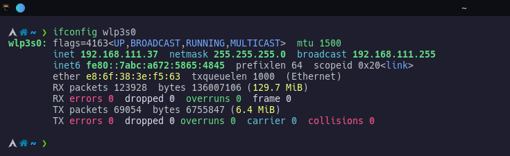
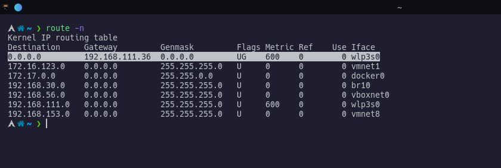

# Network Security

## Introduction Tools
    - Wireshark/Tshark
    - Nmap
    - Traceroute
    - TCP Dump
    - Network Miner
    - Wireless Analysis Tools e.g. Airgeddon
    - 

- Wireshark will be used to capture and demonstrate simple network communication between two hosts.
        

    A set of already captured [pcap](/ftp-protocol.pcapng) files will be analsed to retrieve data transmitted.
    Encrypted data will also be decrytpted so expect a little bit of password cracking techniques applicable to real world.

- Nmap is network mapping tool, it will be used to scan a server for open ports which will give us information which we will use to completely comprimise the server and retrieve secured data.
    

- DNS protocol and important configuration for our lab environment **(Attacking machine and clients/Victim)**

- TCP Three way handshake and analysis demonstartion with wireshark.
    

## Other info

